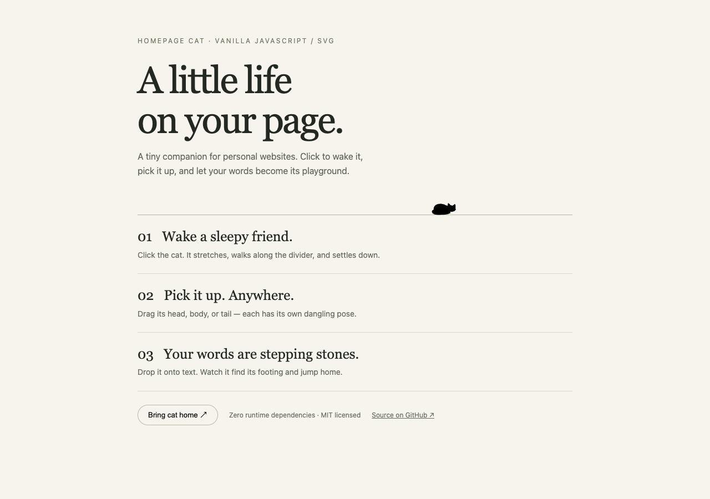

# Homepage Cat

A small black SVG cat that turns your homepage into a playground. Extracted from [AsleepX's homepage](https://asleepx.github.io/).

[中文文档](README.zh-CN.md) · [Demo source](demo/index.html) · [Feature video](media/homepage-cat-demo.mp4)



## Features

- Click or keyboard-activate to wake, walk, and settle back to sleep.
- Grab the head, body, or tail for different dangling poses. Works with pointer/touch input.
- Drop onto text: paws follow sampled glyph contours, then walk and jump back home.
- Mark extra ledges with `data-cat-platform`; text wrapping and font loading refresh terrain.
- Escape while the cat is focused, or `reset()`, brings it home.
- Reduced-motion handling, hidden-tab reset, and teardown for SPA navigation.
- Optional portrait fusion and normalized photo scene maps for advanced integrations.
- Plain ES modules, SVG and CSS. No runtime dependencies, build step, telemetry, or remote API.

## Add to any HTML page

Copy the entire `src/` directory into your site, for example as `/vendor/homepage-cat/`:

```html
<link rel="stylesheet" href="/vendor/homepage-cat/homepage-cat.css">
<main id="page">
  <h1>Hello, world.</h1>
  <div id="cat-home" style="border-top: 1px solid #aaa"></div>
  <p>These words become stepping stones.</p>
  <section data-cat-platform>Another ledge to explore.</section>
</main>
<script type="module">
  import { createCat } from '/vendor/homepage-cat/index.js';
  const cat = createCat({ track: '#cat-home', root: '#page' });
  // cat.reset();
  // cat.destroy(); // remove before replacing your page / unmounting
</script>
```

Serve over HTTP(S), not `file://`. The track needs nonzero width. Keep it in normal page flow and keep transforms off `<body>` (roaming uses document coordinates). CSS uses the `cat-` class prefix plus `.cat`; reserve those names for this component. One instance per document is supported. Repeated mounting without `destroy()` throws explicitly.

## API

`createCat(options)` returns `{ element, reset(), destroy() }`. Import has no DOM side effects, so it is safe to import during SSR; **call it only after the DOM has mounted**. `destroy()` is idempotent and removes listeners, observers, animations and the generated button.

| Option | Default | Meaning |
| --- | --- | --- |
| `track` | required | Connected HTMLElement or selector; the home divider |
| `root` | `document.body` | HTMLElement or selector containing the track; limits text/platform scanning |
| `platformSelector` | `[data-cat-platform]` | CSS selector inside root; element tops become horizontal ledges |
| `portrait` | none | Optional portrait container or selector for four-second face fusion |
| `portraitImage` | none | Optional loaded image or selector for silhouette sampling; use same-origin or CORS-enabled images |
| `earButtons` | `[]` | Optional iterable of release buttons with `data-side="left"` or `"right"` |
| `fusedLabel` | descriptive default | Accessible label during portrait fusion |

Add `data-cat-ignore` to controls or regions whose text should not become terrain. Cross-origin images without canvas permission are skipped. Complex vertical writing, transformed text, closed shadow roots, canvas-rendered text and nested scrolling containers are not supported terrain.

## React / Vue / static generators

Vendor `src/` locally or install from a Git checkout (this package is not yet published to npm). With a bundler, import `createCat` from `src/index.js` and the CSS from `src/homepage-cat.css`.

```jsx
useEffect(() => {
  const cat = createCat({ track: trackRef.current, root: pageRef.current });
  return () => cat.destroy();
}, []);
```

Use Vue's `onMounted` / `onBeforeUnmount` in the same way. In Astro or a static site, use the HTML example. React Strict Mode is supported by the mount/cleanup lifecycle.

## Optional extensions

Portrait fusion requires your own portrait artwork, ear/whisker overlay and release buttons. The library adds `.is-cat` to your `portrait` and reveals the supplied `earButtons` after four continuous seconds over its central face region. Style the overlay in your site. The core demo intentionally uses no personal portrait or photographs.

`src/cat-photo-world.js` exports `photoScenes` and `photoPlatforms`. Register a map with `photoScenes['my-scene'] = [['shelf', [[0, .3], [1, .3]]]]` and mark your image `data-cat-scene="my-scene"`. Coordinates are normalized 0–1 and points must progress left to right with distinct x values. The included maps describe the original homepage photographs, which are not distributed here. Replacing an image requires a new trace. `src/cat-photo-view.js` exposes pure mapping helpers for a custom lightbox; a lightbox UI is not included.

## Run locally

```sh
npm test
python3 -m http.server 4173
# open http://localhost:4173/demo/
```

Tests cover landing, route planning, contour contact, photo coordinates and fusion timing. `scripts/browser-check.cjs` tests the rendered integration and lifecycle; see its header for setup. The video is a real browser recording with Chinese on-screen captions (no audio).

## License

MIT, copyright AsleepX. Keep the license when redistributing. Contributions are welcome; include reproduction steps and a focused test for behavior changes.
